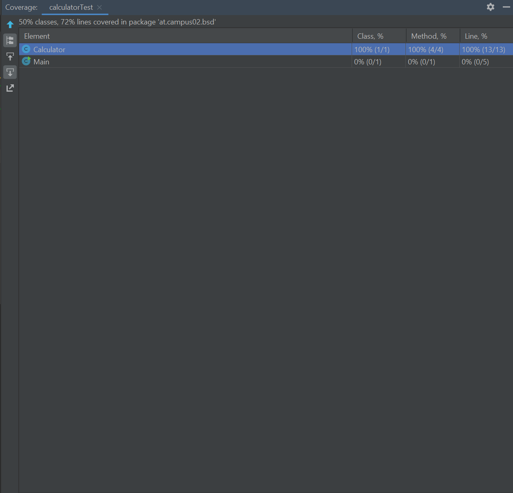
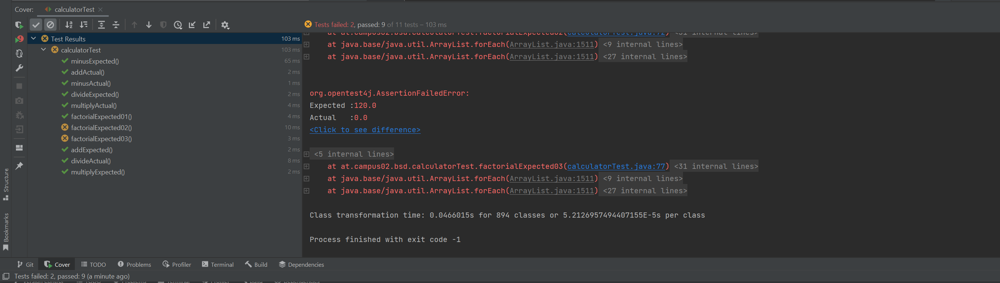

# Exercise 4
## Beschreibung der einzelenen Testcases
In der Datei gibt es zu jeder Rechenoperation genau 2 Testcases. Beim Ersten Testcase wird jeweils das erwartete Testergebnis in den Testcase geschriben. Beim Zweiten Testcase wird das Ergebnis in der jeweiligen Methode berechnet.
 
 
Das folgende Bild zeigt das der Code  der Calculator Klasse zu 100% abgedeckt ist was nicht heist das er keien Fehler mehr enthält. 

 
 
Wenn ein Testcase fehlschlägt sieht man diese Meldung:
